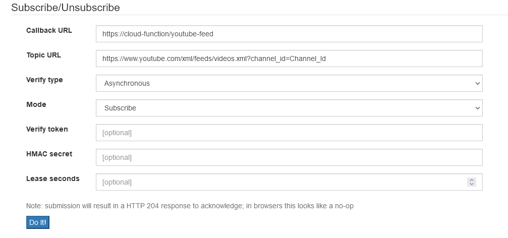
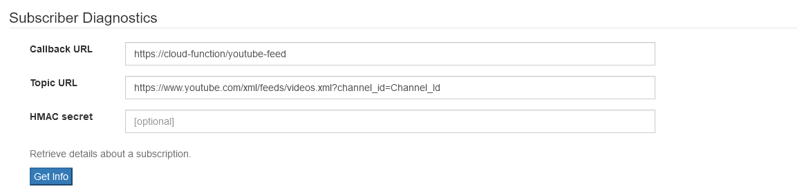
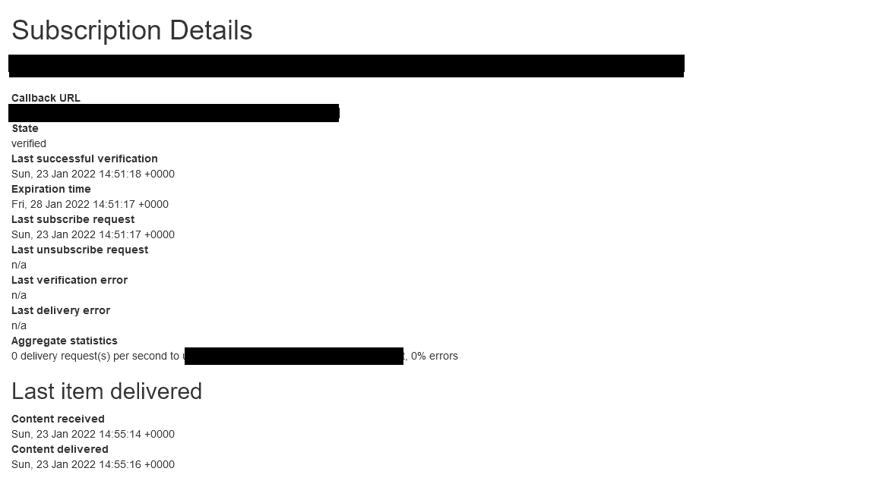

# ✨ Youtube PubSubHubBub With Firebase

Firebase cloud function to handle verification and save/update youtube feed in firestore.

---

## Basic Setup

1. Clone the github repository : `git clone https://github.com/zainulhassan815/youtube-pubsub.git`
2. cd `functions` and run `npm install` to get all packages
3. Navigate back to root directory and open `.firebaserc` file. Replace `Your-Project-ID` with your firebase project id.
4. Update `YOUTUBE_API_KEY` in `functions/src/constants.ts` file. See [Getting Started Guide](https://developers.google.com/youtube/v3/getting-started) for creating a new api key.
5. Run `npm run deploy` to deploy functions to firebase. Copy `youtube-feed` endpoint to clipboard.
6. Go to [GoogleAppspot/Subscribe](https://pubsubhubbub.appspot.com/subscribe) and fillin the details as follows:

   

   - Replace `https://cloud-function/youtube-feed` with your cloud function endpoint
   - Replace `Channel_Id` in `https://www.youtube.com/xml/feeds/videos.xml?channel_id=Channel_Id` with your own channel id.
   - Click do it.
   - In your firebase console, you should see that the function `youtube-feed` is invoked with response 200.

7. Check whether the endpoint is verified or not.

   

   - Replace `https://cloud-function/youtube-feed` with your cloud function endpoint
   - Replace `Channel_Id` in `https://www.youtube.com/xml/feeds/videos.xml?channel_id=Channel_Id` with your own channel id.
   - Click Get Info it.
   - You should get following result with state as verified.

   

## License

Licensed under GNU General Public License, version 3 (GPLv3). [View License](./LICENSE)
